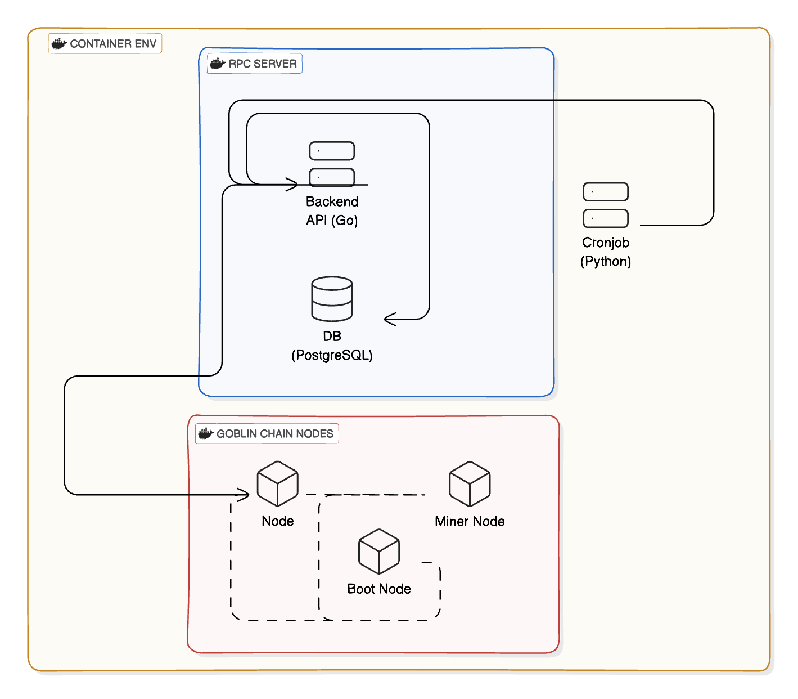

## Overview



Node
- port: `8545`

Backend API
- Port: `8080`

DB
- Port: `5432`

更多設定可以查看 `docker-compose.yaml`

> [!TIP]
> 還有他們全部都跑在同一個網路下，為什麼呢，因為聚在一起才會強大

### 專案架構
`goblin-chain-poa`
- 私有區塊鏈的配置文件

`rpc-server`: 提供的 API 服務包括：
- 查詢區塊高度
- 查詢帳戶餘額
- 領取測試幣
- 將交易資料保存至資料庫
- 查詢指定帳戶的交易資料

`cronjob`
- 定時任務，每 30 秒呼叫 rpc-server 的 API，保存交易資料至資料庫以便追蹤。

### 使用技術
- Geth: 用於搭建私有區塊鏈
- Go: 用於實現後端 API
- Python: 用於定時執行任務和觸發特定服務

本專案為了方便運行，使用了預設設定以及提供測試帳號。建議在正式環境中調整 Docker 相關設定及以其他方式處理敏感資料

> [!CAUTION]
> 特別注意，本專案為了方便可以運行大部分是預設，另外也將測試用帳號一併提供，實務上不要使用，應該調整相關 Docker 設定以及替換成環境變數

其他實作過程中遇到的問題和想法可以參考 `docs` 中的筆記，內容未特別整理，僅供參考。

## Deploy

如果想直接運行此專案可以參考以下步驟

1. 安裝 Docker 和 Docker Compose

2. 啟動 Docker

3. Clone 專案

```zsh
git clone https://github.com/islu/ethereum-private-chain-demo.git
```

4. 切換到專案目錄

```zsh
cd ethereum-private-chain-demo
```

5. 複製環境設定檔

```zsh
cp .env.example .env
```

6. 啟動服務

```zsh
docker-compose up --build -d
```

7. 重啟容器以同步區塊鏈數據（待確認是否有更好的方式）

```zsh
docker restart ethereum-private-chain-demo-geth-rpc-endpoint-1
```

檢查區塊高度是否有增加

```zsh
curl -X 'GET' 'http://localhost:8080/api/v1/chain/blocks/height' -H 'accept: application/json'
```

每 10 秒會產生一個區塊，所以如果區塊高度未增加，請再次重啟容器

7. 訪問 API 文件 http://localhost:8080/swagger/index.html

測試將使用兩個地址：
- `0x8De0c53FC169BA09F111aA4170697e8CF42CCbBe` 提供測試幣的帳號，並定期將交易紀錄保存至資料庫
- `0xd8dA6BF26964aF9D7eEd9e03E53415D37aA96045` 接收測試幣的帳號，隨意替換即可

測試流程：
1. 填入 `0xd8dA6BF26964aF9D7eEd9e03E53415D37aA96045` 領取測試幣
2. 查看該地址的餘額
3. 查詢 `0x8De0c53FC169BA09F111aA4170697e8CF42CCbBe` 的發送紀錄，以確認資料庫是否有更新


8. 停止服務

```zsh
docker-compose down
```

如果不再需要，可以刪除專案底下生成的 `db_data` 目錄，該目錄用於存放資料庫資料
